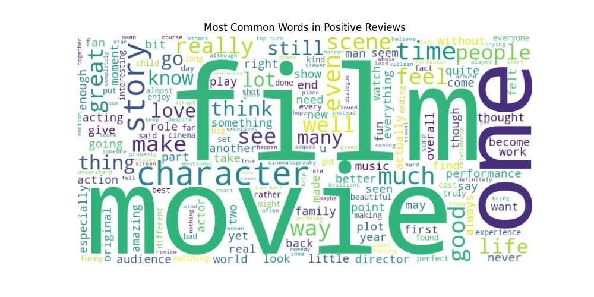
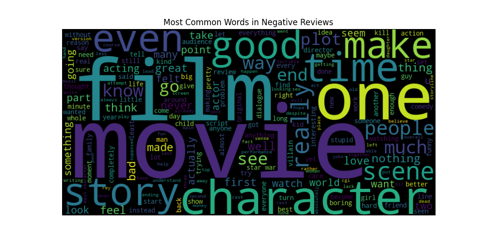
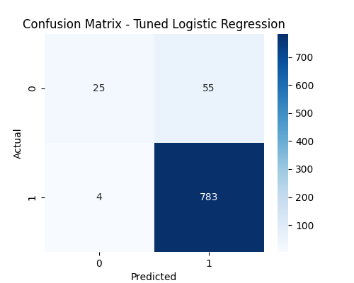
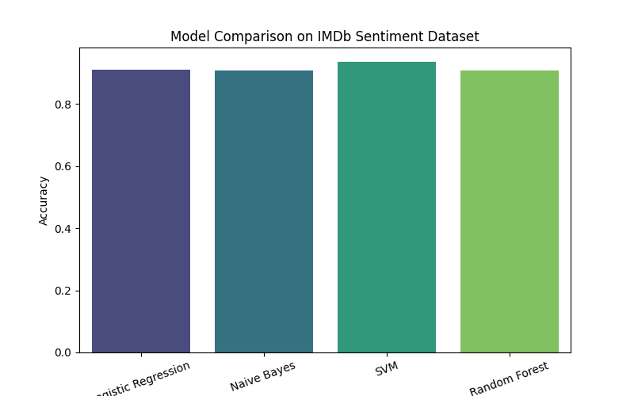

# IMDb Movie Review Sentiment Analysis

**Author:** Rutuja1423

---

## Problem Statement

Online movie reviews play a significant role in shaping audience decisions. With thousands of reviews posted daily on platforms like IMDb, manually assessing overall sentiment is impractical. There is a need for an automated system that can accurately classify the sentiment of movie reviews as **positive** or **negative** based on their textual content.

This project addresses this challenge by building a machine learning pipeline that processes raw review text, extracts meaningful features, and trains classification models to predict sentiment.

---

## Objectives

- Clean and preprocess raw IMDb movie review text for analysis.
- Engineer sentiment labels from numerical review ratings.
- Extract numerical features from text using TF-IDF vectorization.
- Train and compare multiple machine learning classifiers (Logistic Regression, Naive Bayes, SVM, Random Forest).
- Perform hyperparameter tuning to optimize model performance.
- Evaluate model performance using accuracy, F1-score, confusion matrix, and classification reports.
- Visualize results through word clouds and comparative bar charts.
- Demonstrate real-world applicability with custom review predictions.

---

## Dataset

The dataset consists of IMDb movie reviews with associated numerical ratings:

- **Source:** IMDb
- **Format:** CSV
- **Location:** `Data/imdb_reviews.csv`
- **Label Engineering:**
  - Rating >= 7 &rarr; Positive
  - Rating <= 4 &rarr; Negative
  - Ratings 5-6 (neutral) are excluded to create a clear binary classification boundary.

---

## Project Structure

```
imdb-sentiment-analysis-ml/
├── Data/
│   └── imdb_reviews.csv              # Raw dataset
├── Images/
│   ├── Figure_1.png                  # Word cloud - Positive reviews
│   ├── Figure_2.png                  # Word cloud - Negative reviews
│   ├── Figure_3.png                  # Confusion matrix
│   └── Figure_4.png                  # Model comparison bar chart
├── sentimental_analysis.py           # Python script (full pipeline)
├── sentimental_analysis.ipynb        # Jupyter Notebook (with interpretations)
├── requirements.txt                  # Python dependencies
└── README.md                        # Project documentation
```

---

## Methodology

### 1. Text Preprocessing

- Removal of HTML tags and non-alphabetic characters
- Lowercasing
- Stopword removal using NLTK
- Lemmatization using WordNet

### 2. Feature Extraction

- **TF-IDF Vectorization** with a vocabulary of 5,000 features
- Unigram and bigram support (`ngram_range=(1, 2)`)

### 3. Model Training and Comparison

| Model | Description |
|---|---|
| Logistic Regression | Linear classifier, well-suited for sparse text features |
| Multinomial Naive Bayes | Probabilistic classifier, fast and effective for text |
| Linear SVM | Finds optimal separating hyperplane in feature space |
| Random Forest | Ensemble of decision trees for non-linear alternative |

### 4. Hyperparameter Tuning

- Grid search with 5-fold cross-validation on Logistic Regression
- Parameters explored: regularization strength (`C`), penalty type, solver algorithm

### 5. Evaluation Metrics

- Accuracy
- F1-Score
- Confusion Matrix
- Classification Report (Precision, Recall, F1 per class)

---

## Results

| Model | Accuracy | F1-Score |
|---|---|---|
| Logistic Regression | ~90.9% | ~0.95 |
| Naive Bayes | ~90.8% | ~0.95 |
| **SVM** | **~93.4%** | **~0.96** |
| Random Forest | ~90.8% | ~0.95 |

- **SVM achieved the highest accuracy and F1-score** across all models.
- Linear models consistently outperformed the tree-based ensemble on sparse TF-IDF features.
- The confusion matrix revealed a bias toward the majority class (positive reviews), with reduced recall for the negative class due to class imbalance.

---

## Visualizations

### Word Clouds

| Positive Reviews | Negative Reviews |
|---|---|
|  |  |

### Confusion Matrix



### Model Comparison



---

## Installation and Usage

### Prerequisites

- Python 3.8 or higher

### Setup

1. Clone the repository:
   ```bash
   git clone https://github.com/Rutuja1423/imdb-sentiment-analysis-ml.git
   cd imdb-sentiment-analysis-ml
   ```

2. Install dependencies:
   ```bash
   pip install -r requirements.txt
   ```

3. Run the analysis:

   **Option A:** Python script
   ```bash
   python sentimental_analysis.py
   ```

   **Option B:** Jupyter Notebook
   ```bash
   jupyter notebook sentimental_analysis.ipynb
   ```

---

## Technologies Used

| Technology | Purpose |
|---|---|
| Python | Core programming language |
| Pandas | Data manipulation and analysis |
| NumPy | Numerical operations |
| Scikit-learn | Machine learning models and evaluation |
| NLTK | Natural language processing (stopwords, lemmatization) |
| Matplotlib | Data visualization |
| Seaborn | Statistical visualization |
| WordCloud | Word cloud generation |

---

## Future Improvements

- Apply class balancing techniques (SMOTE, class weights) to improve negative-class recall.
- Experiment with deep learning models (LSTM, BERT) for context-aware classification.
- Expand to multi-class sentiment analysis (positive, neutral, negative).
- Build a web-based interface for real-time sentiment prediction.

---

## License

This project is intended for educational and research purposes.

---
